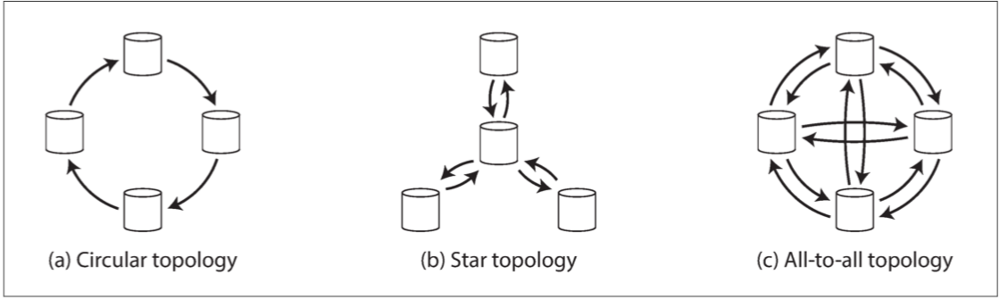

## 前言

互联网企业里或多或少都会有些数据密集型系统，比如一家互联网教育企业，付费用户虽然不多，但视频观看打点频率高，观看日志的数据量可以很大；一个在线聊天软件，用户聊天数据也会快速增长。《设计数据密集型应用》[^1]一书内容丰富，涵盖了数据系统存储细节、分布式、数据一致性等问题，由浅入深，由底层细节到顶层架构，循序渐进地展开一张数据密集型系统的画卷全貌。

## 可靠性、可伸缩性和可维护性

与数据密集型系统对应的是计算密集型系统。在互联网行业中，更常见的是数据密集型系统。此书的目标是介绍如何打造**可靠、可伸缩、可维护**的数据系统。

- 可靠性：系统在困境中（硬件故障、软件故障、人为错误）仍可以正常工作
- 可伸缩性：有合理的办法应对系统的增长（数据量，流量，复杂性）
- 可维护性：许多不同的人，在不同的声明周期，都能高效的在系统上工作

提高可靠性：
- 硬件：提高冗余度
- 软件：彻底的测试、进程隔离、允许崩溃重启、测量/监控/自检/报警等
- 人为错误：沙箱环境、只读环境、允许快速回滚、允许数据重算、API 限制、管理后台、人员培训等（最小化犯错误机制，允许犯错并修复，监控错误产生）

性能：批处理关注吞吐量，在线服务系统关注**响应时间**。

通常使用响应时间的高位百分比描述服务性能。比如: 50%的响应小于200ms，99% 的响应时间小于 1s，即 `p50<100ms, p99<1s`。

可伸缩性：纵向伸缩（scaling up），横向伸缩（scaling out）。

可维护性与软件系统设计的原则：
- 可操作性：便于（运维团队）维护系统平稳运行
- 简单性：从系统中尽可能消除复杂度。减少系统状态、降低模块耦合、理清依赖关系、术语命名一致...
- 可演化性（可扩展性，可塑性）

## 数据模型与查询语言

常见的数据模型：
- 网状模型（CODASQL 为例）：数据库存在模式；访问特定记录需要遍历其中一条路径；查询是命令式，难以编写和维护
- **关系型：写时模式（schema-on-write）**；范式设计导致从数据到代码对象需要复杂的转化；能够更好的处理多对多的关系；查询时通常需要遍历更多的数据
- **文档型：读时模式（schema-on-read）**；代码查询简单；文档引用技术解决多对多的关系；查询局部性相对好；更新文档通常需要整个重写。
- **图模型**：更适合多对多的关系；顶点和边不仅限于一种类型，顶点可以表示人、地点、事件，边可以表示哪些人彼此是好友、谁参与了哪个事件；适用于社交图谱，网络图谱，公路铁路网络等。
- 其他：用于基因相似性检测的搜索引擎（序列相似性搜索）；全文搜索；PB级大数据存储模型。

声明式查询语言（SQL，mongo，es）：简单容易；隐藏了数据库细节，便于兼容前后版本；适合并行查询。

命令式查询语言（例如 CODASQL）：类似编程语言的执行逻辑。

MapReduce 介于声明式和命令式之间，使用代码逻辑编写，但能够并行在多台机器上分布式执行。

## 存储与检索

存储引擎的两个大类
- 日志结构（log-structured）
- 面向页面（page-oriented）

日志结构存储引擎通常是**追加写**，在机械硬盘上性能较好，崩溃恢复简单，日志文件分段，删除使用特殊的标记，段文件可以后台合并，单独一个写线程避免并发问题。

日志结构的散列索引：范围查询性能很低；必须能够放在内存里，否则磁盘映射性能很低。

SSTable 排序字符串表，**LSM（日志文件合并树）**：
- 每个段文件内 key 是有序的
- 多个段文件合并后按照 key 的顺序写入到新段文件
- 当前段文件使用有序结构（红黑树等）维护在内存中，磁盘维护当前分段的顺序写日志；达到一定阈值，写入新段文件，删除旧的顺序写日志
- 使用 bloom 过滤器，优化不存在的 key 的查找
- 有序 key 可以加快范围查询

面向页面结构的存储引擎通常使用 **B 树**及其变体作为存储引擎。

- B 树将数据库分解成固定大小的块或页，一次性只能读取或写入一个页面；这种设计接近底层页面，因为磁盘空间也是按照固定大小组织的
- 页面之间使用地址（硬盘地址，而非内存地址）互相引用，构建出树
- 一个页面的引用数量称为**分支因子**，通常是几百（分支因子为 500 的 4KB 页面的四层树可以存储 256T 数据）
- 使用预写日志（WAL，或重做日志 redo log，追加写文件）实现崩溃恢复
- 使用锁控制页面写入
- 如果一个页满了，则分裂成两个半页
  
**B 树相关优化**：
- 字符串 key 可以不存储整个键，缩短键大小以增大分支因子
- 写时复制，经过修改的页面写入到不同位置，便于并发控制和崩溃恢复
- 使叶子页面尽量放在相同的位置
- 额外的指针，使用每个叶子页面可以连接左右兄弟页面，顺序扫描不需要跳回父级
- 分形树（fractal tree）[^2]，在节点上缓存变更操作，接用日志结构的思想减少磁盘查找

数据仓库的**列式存储**（在线分析处理 OLAP）：
- 每个列存储在单独的文件，所有列包含的行的顺序是对应的，可以通过列构建出行
- 数仓事实表的列通常很多，数据分析时只关心若干列，没必要把其他列读出来
- 列数据存储在一起便于压缩，比如有些列只有若干可能的值，通过位图编码可以极大压缩；列排序后对于压缩更友好
- 使用 LSM，分批次写入数据，降低大量数据写入的瓶颈
- 物化视图，对于 count、sum、svg、max 等数据物化存储，便于查询

## 编码和演化

常用的文本格式编码：json，xml，csv；易读，但数据量相对大；二进制编码：protobuf，thrift；数据量通常能压缩 20% 以上，缺点是不可读；编程语言特定的编码仅限于单一语言，通常不使用。

## 复制

**主从模式**是比较常见的模式模式。Mysql、redis、PostgreSQL、kafka 等都是用主从模式。

同步复制：主库等待从库复制完成再响应请求。能够保证从库与主库数据一致，主库不可用时，从库包含完整的数据。但如果从库故障，主库也无法写入。

半同步：一个从库使用同步复制，其他从库是异步的。确保有一个从库是同步复制的。

异步复制：主库的写入不能保证持久。

**复制的实现**：
- 基于语句的复制：使用非确定性的语句、函数，以及现有数据不一致时，可能导致语句在从库上产生的效果不同。
- 基于预写日志复制（WAL）：预写日志通常涉及到底层存储，比如覆写某个磁盘页，不同版本之间可能不兼容。
- **基于行的逻辑日志复制**（例如 binlog）：将复制日志从存储引擎中解耦出来，且对于外部来说，逻辑日志更容易解析，便于发送到外部系统中处理
- 基于触发器的复制：灵活性强，但开销比较高。

异步复制因为网络延迟的存在，只提供最终一致性。

**读己之写**：用户提交完数据想要立刻查看，则新数据未到达副本，可能导致未查到，像是数据丢失。确保写后读一致性的一些方式：
- 对于用户可能修改过的数据，总是从主库读。比如用户读取自己的个人信息走主库，读取其他人的信息走从库
- 如果应用的大部分内容都可能被用户编辑，则可以跟踪上次更新时间来决定是否读从库。还可以监控从库延迟
- 客户端可以记录最后一次写入的 逻辑时间戳，据此判断是否读从库
- 如果副本分布在不同地理位置的数据中心，则更复杂。任何需要主库提供服务的请求，都需要被路由到主库所在的数据中心

**单调读**：确保每个用户总是从一个副本读取，避免来回切换延迟时间不同的副本，导致读的数据一会儿有一会儿没有。

**一致前缀读**：具有因果关系的一系列数据写入后，读取这些数据也必须按照相同的顺序出现。比如 A，B 两个有因果关系的事件先后写入数据库后，用户读从库的时候不能只读到 B 但没有读到 A。通常在分片或分区数据库中会出现这种场景，需要确保具有因果关系的事件写入到相同分区。

**多主复制**的使用场景：
- 运维多个数据中心，数据就近访问，降低地理位置导致的延迟
- 需要离线处理的客户端，比如印象笔记
- 协同编辑

多主复制最大的问题是写入冲突。
- 避免冲突：对相同记录的操作路由到同一个数据中心
- 收敛至一致的状态：每个写分配一个 ID，冲突时 ID 大的覆盖小的（数据丢失）；以某种方式把值合并在一起；编写解决冲突的代码。

多主复制的一些拓扑：

**无主复制**：客户端直接将写入发送到多个副本（通常会有个协调者节点，代替客户端写入，节点之间没有固定写入顺序）。无主复制处理节点数据不一致方案：
- 读修复：读取时，修复陈旧的节点数据（冷数据可能用于读不到，不会修复）
- 反熵过程：后台进程不断查找副本差异，修复数据

**读写的法定人数**：假设有 n 和副本，w 个副本确认表示写入成功，读取时需要从 r 个副本读取 
- 需要确保 w+r > n，这样读的副本里至少有一个是最新的 
- 通常 w = r = (n+1)/2 
- w 越大，r 越小；则 读取效率高，写入效率低，适合读多写少的系统；

**检测并发写入**：多个客户端可以同时对一个 key 写入，但写操作可能按照不同顺序到达不同节点。并发写入规避方案：
- LWW 最后写入胜利：每个请求加一个时间戳，大的覆盖小的
- 一个键只允许写入一次，不允许更新
- 写入前先读取，读取值包含版本号，写入时传入版本号，只能覆盖相同或更低的版本号
- 使用客户端程序合并写入
- 版本向量：对于一个键值，所有副本的版本号的集合成为版本向量，读取值时，版本向量会发送给客户端，写入时需要传给数据库。版本向量允许数据库区分覆盖写入和并发写入。

## 分区

分区通常和复制同时使用，每个分区的副本存储在多个节点上。如果分区是不公平的，则一些分区比其他分区有更多的数据和查询，产生**数据偏斜**，导致分区效率下降。

根据键的**范围分区**。例如百科全书按照关键字的分区。分区边界可以由管理员手动选择，也可以由数据库自动选择。Bigtable/HBase 使用类似方法。优点是存在顺序性，便于范围查找；但容易造成数据倾斜。比如键中带有时间戳 -- 可以在时间戳前面加上其他的字段。

根据键的**散列分区**。好的散列函数可以把键均匀分布，但范围查询效率低。

Cassandra 的折衷策略：主键采用多个列组成，第一个列用作 hash 分区，后续键使用 SSTables 排序；如果指定了第一个键查询，则后续的键可以范围查找。

**负载偏斜与热点消除**：极端情况下，某些键会被大量的读取写入，比如热点微博的数据；这种热点数据或造成分区的负载偏斜。解决方案：使用一定策略，判断这些键需要被额外分区，比如后面加上后缀，{id}_0,{id}_1... 把热点数据分成若干份，存储在不同分区，读取的时候再进行合并。

**基于文档的次级索引进行分区**。即每个分区维护自己分区内文档的次级索引，查询的时候并发从各个分区查询；这种方案比较简单，但并发多条查询容易导致尾部延迟放大。

**基于关键词（term）的次级索引进行分区**。构建覆盖所有分区数据的全局索引，全局索引也需要分区，可以采用与主键不同的分区方式。 关键词分区；关键词（term）源自全文搜索引擎，指文档中出现的所有单词。这种次级索引分区方式写入速度慢，且比较复杂；在实践中，对全局索引的更新通常是异步的。

分区**再平衡**策略：
- 反面教材：hash mod n，导致再平衡发生时大量数需要移动
- **固定数量的分区**：分区数量比节点数量多，比如 5个节点，100 个分区，如果一个节点挂了，则另外四个节点均分挂掉的 20 个分区。 Riak/ES/CouchBase/Voldemort 都使用这种策略
- 动态分区：分区增长到一定大小时，会被分成两个分区，各拥有一半数据；如果大量数据删除，分区变小，则可以合并分区。动态分区同时支持 hash 分区和范围分区。 HBase/MongoDB
- 按节点比例分区：分区数与节点数成正比，即每个节点具有固定数量的分区，通常每个节点的分区数比较多，以保证数据的平衡。Cassandra 中，每个节点默认 256 个分区。

分区**请求路由**方式：
- 允许客户连接任何节点（通过循环策略的负载均衡，Round-Robin Load Balancer），如果节点有请求的分区，则直接处理请求；否则，它转发到其他节点，收到回复并返回给客户端
- 将客户的请求发送到路由层，它决定应该处理请求的节点，并进行转发
- 要求客户端知道分区和节点的分配

## 事务

**事务的 ACID**：
- 原子性（Atomicity）：能够在错误时中止事务，丢弃该事务的所有写入变更的能力
- 一致性（Consistency）：对数据的一组特定约束始终不变
- 隔离性（Isolation）：同时执行的事务是相互隔离的。
- 持久性（Durability）：持久性是一个承诺，即一旦事务完成，即使发生硬件故障或数据库崩溃，写入的任何数据也不会丢失。完美的持久性是不存在的。

**非事务的 BASE**：
- 基本可用性（Basically Available）
- 软状态（Soft State）
- 最终一致性（Eventual Consistency）

对于应用而言，没有事务，错误处理复杂很多；没有隔离性，就会导致并发问题。

可串行化的隔离级别保证事务的执行效果如同串行发生；会有严重的性能损失，一般数据库不使用。一般事务只使用弱的隔离级别。

**读已提交**：提供了两个保证
- 从数据库读时，只能看到已提交的数据，没有脏读
- 写入数据库时，只能看到已提交的数据，没有脏写

数据库使用 行锁 来防止脏写（两阶段锁协议）

**快照隔离 和 可重复读**：一些情况下无法容忍同一个事务多次读的数据不一致（或一致性遭破坏）
- 备份；如果备份了一部分新 一部分旧的数据，会破坏一致性
- 分析查询和完整性查询：需要扫描大量的数据，不一致的数据可能导致完整性损坏

快照隔离的实现：
- 使用写锁防止脏写
- 读取不需要加锁，性能方面：读不阻塞写，写不阻塞读
- 多版本并发控制（MVCC）：维护单个对象的多个版本，mysql 使用 undolog 实现访问旧版本；读已提交为每个查询使用单独的快照；可重复读（快照隔离）对整个事务使用相同的快照
- 每一行都有 created_by 和 deleted_by 字段，存储它被创建，被删除的事务ID
- update 操作在内部被翻译成 delete 和 insert 操作

事务 ID 决定了它能看到哪些对象：
- 每次事务开始时，数据库列出当时其他（尚未提交或尚未中止）的事务清单，即使后续提交了，这些事务已执行的任何写入也都会被忽略
- 被终止事务写入的任何执行都会被忽略
- 有具有较晚事务的事务ID所作的任何写入都会被忽略
- 所有其他写入，对应用是可见的

防止丢失更新的场景与办法：（事务执行顺序为 读 - 修改 - 写入序列，可能导致写入互相覆盖，丢失更新数据）
- 原子写： `update x set val = val +1 where y=b;`
- 显式锁定：`select * from xx where a = b for update;`
- 自动检测丢失的更新：postgresql 的可重复读会自动检测丢失更新，并中止惹麻烦的事务；mysql 的 Innodb 不会。一些人认为**能够自动检测丢失的跟更新**才称得上是快照隔离
- CAS，比较并设置，`update x set val=val2 where id=1 and val=valold;`

**写入偏差与幻读**：案例：select count(*) from xx where a=b; 当 count > 2 时，写入一条新的 a=b 的数据；并发写入时，破坏了 count > 2 的约束条件。解决办法：
- 使用 select for update，显式锁定
- 物化冲突。人为地在数据库中引入一组对象，用作锁。比如会议室预定的场景下，可以床架一个时间槽和房间槽的表，写入预定记录之间先使用 select for update 锁定槽位。

可串行化有多种实现方案：单一线程顺序执行事务（性能低）、两阶段锁定、可串行化快照隔离。

可串行化的两阶段锁定：读会阻塞写，写会阻塞读；事务提交后释放锁；悲观锁，性能差。

可串行化的快照隔离方案：乐观锁；事务写入数据库时，必须在索引中查找最近读取的受影响数据的其他事务，如果数据已不是最新的，则中止事务。

## 分布式系统的麻烦

分布式系统中容易发生**部分失效**（以某种不可知的方式被破坏）。部分失效是不确定性的：任何涉及到多个节点和网络的事情，它有可能会工作，有时会出现不可预知的失败。

不可靠的网络：当发出请求并期待响应，可能在任何节点任何阶段出错。处理这个问题的常用方法是**超时**。

不可靠的时钟。NTP 网络时间协议。它允许根据一组服务器报告的时间调整自己的时间。
- 日历时钟：根据某个日历返回当前的时间，比如 unix 时间戳。日历时钟经常与 NTP 同步，可能导致时间回溯的情况。
- 单调时钟：它保证时间总是向前走的，适合测量持续时间（例如时间间隔），NTP 同步时，如果过快，则向前走的频率可以调低 0.05%，如果过慢，则可以调快 0.05%。单调钟可以是系统启动后的纳秒数。
- 逻辑时钟，使用递增计数器，而不是石英振荡器。

真相由多数定义，通过投票以减少对某个特定节点的依赖。

一个 gc 导致锁失效，但代码继续执行覆盖了后续写入数据的案例：

使用递增 token；比如使用 zookeeper 作为锁服务，可以使用 txid 或者节点的 cversion 作为令牌，因为它保证单调递增。

**拜占庭故障**：有些节点可能因为延迟或其他原因，有意或无意发出错误消息 -- 比如告知没有收到某条写请求。当一个系统中部分节点出现故障、不遵守协议、甚至恶意攻击、扰乱网络时仍能正常工作，称为拜占庭容错。常见系统：飞行控制系统，区块链系统。

**弱谎言形式**：假定节点不会故意撒谎，使用防止撒谎的弱形式机制，比如：
- 网络系统中的校验和，检测可能因为硬件或其他问题导致数据包损坏
- 校验用户的输入合法性
- 使用加权平均作为从多个分布式系统中同步的值，比如 币价/NTP时间

**安全性：安全性被违反后，违规行为不能被撤销** -- 损失已经发生。比如 唯一性和单调序列属于安全性，如果产生了重复值，则系统损失已经发生，这个动作也不会恢复。**活性：活性被破坏后，未来可能恢复**，比如可用性，如果出现节点故障，暂时不可用，但未来也会是可用的。包括 最终一致性，也属于活性。

**算法的正确性建立在我们假设的系统之上**，比如我们假设拜占庭故障节点数量低，所以算法才能成立，我们假定节点存储的数据不丢失，才能保证法定人数算法能够正确。 而现实世界可能会发生各种情况打破假设。 证明算法正确并不意味着它在真实系统中一定正确。

## 一致性与共识

大多数复制的数据库至少提供了**最终一致性**。

**线性一致性**：**数据库提供只有一个数据副本的假象**，多个客户端在任何时候读取的数据，都能在某个时间点变更后，读到新数据。

依赖线性一致性的场景：
- 锁定和领导选举；如果违反线性一致性，则可能出现脑裂
- 约束和唯一性保证
- 跨信道的时序依赖：比如上传完图片后，发送图片 url 到消息队列，异步任务处理消息获取 url 对应图片并处理，结果图片还未同步到其他节点，访问不到图片，或访问的是旧图片

**CAP 定理**：
- 网络分区是一种故障类型，所以它并不是一个选项：它一定会发生
- 如果需要线性一致性，则发生副本掉线时，系统需要等待，期间不可用
- 如果应用不需要线性一致性，则某个副本断开后，也可以独立处理请求

顺序保证了线性一致性，线性一致性包含了**因果一致性**。线性顺序是全序的，表现为系统中好像只有一个副本，而因果关系是偏序的，存在因果的两个事件是有序的，无因果关系的事件无序。线性一致性强于因果一致性。一个系统可以是因果一致的，而避免线性一致性带来的性能损耗。

为了确定因果顺序，数据库需要知道应用读取了那个版本的数据：
- 比如写操作需要传入之前读操作得到的数据版本号
- 可串行化隔离快照中，数据库检查它读取的版本是否依然是最新的

**兰伯特时间戳**：由（计数器，节点ID）组成；计数器更大，时间戳更大；计数器相同，节点ID大的更大。

**全序广播**满足两个安全属性：
- 可靠交付：没有消息丢失，如果消息被传递到一个节点上，它将被传递到所有节点
- 全序交付：消息以相同的顺序传递到每个节点

全序广播的重要表现：顺序在消息送达时被固化，如果后续的消息已经送达，节点就不允许追溯地将之前的消息插入顺序中较早位置。（解决了并发覆盖写导致数据不一致问题）

使用全序广播实现线性一致性存储。使用仅追加日志的方式实现这种 CAS 操作：
1. 在日志中追加一条消息，并试探性的指明你想要的用户名
2. 读日志，并等待你刚才追加的消息被读回
3. 检查是否有任何消息生成目标用户名的所有权，如果第一条是你的消息，则操作成功，你可以提交声称的用户名并向客户端确认。如果第一条消息来自其他用户，则中止操作。

使用全序广播实现读取线性一致性的方案：
- 可以先向日志中追加一条消息，直到消息被读回，才执行实际操作 -- 此时说明读之前的消息已全部同步
- 查询最新消息的位置（如果允许的话），直到同步到此位置，再进行读取操作
- 从同步更新的副本中读取

**两阶段提交**使用一个通常不会出现在节点上的新组件：协调者（也叫事务管理器） -- 它可能是客户端上的一个库，或一个进程，或一个单独的服务。协调者向所有参与者（节点）发送 prepare 请求：
- 如果所有参与者都回答“是”，则协调者在第二阶段发出 commit 请求
- 如果任一参与者回答“否”，则协调者在第二阶段发出 abort 请求

系统承诺：
- 事务ID全局唯一
- 在参与者单节点事务上带上此事务ID
- 当应用准备提交，协调者向所有参与者发送 准备 请求，并打上全局事务ID 的标记。如果任一请求失败或超时，则协调者向所有参与者发送针对此事务ID的中止请求
- 参与者收到准备请求时，如果回答 是，则参与者需要确保只要请求，就一定能够提交
- 当协调者收到所有答复时，会对是否提交事务做出决定；协调者必须把决定写到磁盘的事务日志中，如果随后崩溃恢复，也能够知道自己做出的决定。这被称为提交点
- 一旦协调者的决定落盘，提交或放弃请求会发送给所有参与者。如果请求失败或超时，则必须一直重试下去

协调者失效时，如果刚好有事务执行完第一阶段，未收到第二阶段的参与者节点会一直处于 存疑 状态，直到协调者回复。存疑时会一直持有锁，直到事务提交或中止。

**共识问题**通常形式化如下：一个或多个节点可以提议（propose），而共识算法决定（decides）。共识算法必须满足以下性质：
- 一致同意：没有两个节点的决定不同
- 完整性：没有节点决定两次
- 有效性：如果一个节点决定了值 v，则 v 由某个节点所倡议
- 终止：由所有未崩溃的节点来最终决定值

**纪元编号与法定人数**（raft 协议[^3]）
- 协定定义了一个纪元编号，并确保每个时代中，领导者都是唯一的
- 纪元编号是递增的，领导者被认为挂掉后，需要重新投票；两个不同时代的领导者之间出现冲突，更高纪元编号的说了算
- 必须从 法定人数 的节点中获取选票
- 两轮投票：第一次是为了选出领导者；第二次是对选出的领导者进行表决（类似两阶段提交）；这两次投票的法定人群必须相互重叠（即要求法定人数 > n/2）

## 批处理

一个 MapReduce 作业和一个 Unix 进程相类比：它接收一个或多个输入，并产生一个或多个输出。MapReduce 在分布式系统上读写文件 -- HDFS Hadoop 分布式文件系统。

HDFS 在每台机器上运行了一个守护进程，它对外暴露网络服务，允许其他节点访问存储在该机器上的文件。名为 NameNode 的中央服务器会跟踪那个文件块存储在哪个机器上。为了容忍机器和硬盘故障，文件被复制到多台机器上。

**MapReduce** 基本工作流程：输入格式解析器处理输入；Mapper 函数提取键值对；输出数据到 Reducer 时会自动按照键值对排序；Reducer 处理每个键的所有值。

Mapper：Mapper 会在每条输入记录上调用一次，从每条输入记录上提取键值。对于每个输入可以生成任意数量的键值对，包括 None。无状态，每条记录是独立的。

Reducer：MapReduce 框架拉取由 Map 生成的键值对，收集属于同一个键的所有值，并在这组值上迭代调用 Reducer。Reducer 可以产生输出记录。

将计算放在数据附近：每个输入文件的大小通常是几百兆，MapReduce 调度器试图在每台存储输入文件副本的机器上运行每个 Mapper。节省了网络复制输入文件的开销。

## 流处理

在流处理中，一个事件由生产者产生一次，然后可能由多个消费者处理。相关的事件通常被聚合成一个主题（topic）或流（stream）。

消息传递系统的方案：
- 直接从生产者传递给消费者：UDP、无代理的消息库 ZeroMQ nanomsg 等、通过 http 或者 rpc 传递给消费者（webhook）
- 消息代理：kafka、redis等

**消息代理**：
- 通常 消息传递给消费者后会自动删除（或保存一段时间后删除）
- 队列工作集比较小，比如 kafka 默认保存 7 天
- 支持按照某种模式匹配主题，订阅其子集
- 不支持任何查询，通常只能流式订阅

多个消费者从同一主题读取消息的模式：负载均衡，每个消息被传递给消费者之一；扇出（fan-out），每个消息被传递给所有消费者。

确认与重新传递：客户端显式告知消息代理 消息已经处理完毕。

分区日志：基于日志的消息代理。对日志进行分区，存储在不同的机器上；每个分区内，消息被分配一个单调递增的序列号（或偏移量）。记录消费者消费某个分区消息的进度，称为消费者偏移量。

当消费者跟不上生产者时：丢弃消息、进行缓冲、施加背压，影响生产者的速度。可以监控消费者落后日志头部的距离，落后太多就发出报警。

保持多系统数据同步的方式：
- **双写**：比如写入数据库时，同时写入数据库和缓存/ES。但并发写入到每个系统的时间不一致，发生冲突导致系统数据不一致
- **变更数据捕获（CDC）**：捕获数据库的变更日志，通过消息代理给多个系统消费，同步数据

系统变更事件是不可变的，所以可以从事件日志派生出当前状态。

流处理的一些场景：
- 复合事件处理
- 流分析，例如 prometheus（滚动计算、区间对比统计、测试事件速率）
- 维护物化视图：缓存，搜索索引，数据仓库
- 在流上搜索：先构建搜索查询，再在流数据上跑查询
- 消息传递和 rpc

流分析的时间窗口类型：
- 滚动窗口：每个事件只能属于一个窗口，比如 一分钟一个窗口
- 跳动窗口：固定长度，但允许窗口部分重叠，例如：一个步长为 1 的，长度为 5 的跳动窗口
- 滑动窗口：跟跳动相比，没有步长的概念，不断往窗口添加新数据，移除旧数据
- 会话窗口：没有固定持续时间，将一个用户出现时间相近的事件联系在一起

**流流连接**：在处理流数据时，需要额外的数据库存储流事件，以便另一个事件到达后能够查询到此事件。
**流表连接**：创建事件时，把数据库副本数据写入到事件里，这样处理事件时不用查询数据库；或者处理事件时查询数据库。

流处理中的容错手段：微批次和存档点、使用事务原子提交、幂等性、失败后重建状态。

## 数据系统的未来

**组合使用衍生数据的工具**，比如搜索引擎/缓存/分析型数据库。分布式事务性能较低，容错能力差，但提供线性一致性，读己之写；衍生数据通常是异步的，提供最终一致性。

**组合使用数据库存储技术**：次级索引、物化视图、复制日志、全文搜索引擎。

**联合数据库**：统一读取。为各种各样的底层存储引擎和处理方法提供统一的查询接口；例如 PostgreSQL 的外部数据包装器。**分拆数据库**：统一写入；变更日志捕获衍生到其他系统。

将事情做正确：
- 端到端原则：只有在通信系统两端应用的知识和帮助下，所讨论的功能才能完全正确的实现。比如 tcp 两端需要记录维护序列号；比如幂等操作需要两端都保证唯一标识符。
- 强制约束。唯一性约束需要达成共识：最常见的方式是使用单节点作为领导，负责所有决策；全序广播；分区依赖消息日志进行处理。
- 及时性与完整性。事务通常提供一致性：一致性实际包含 及时性（线性一致性，读己之写）和完整性。
- 信任但验证。不要盲目信任承诺。审计，审查数据完整性。

做正确的事情：预测性分析可能存在的偏见与歧视，推荐系统的责任问题，反馈循环功能。隐私与追踪需要符合法律法规，防止用户数据滥用，允许用户选择是否同意上传个人数据等。

[^1]: 《Designing Data-Intensive Applications》Martin Kleppmann. 中文翻译 http://ddia.vonng.com/ 冯若航 （@Vonng）

[^2]: 分形树 https://en.wikipedia.org/wiki/Fractal_tree_index

[^3]: raft 协议动画演示 http://thesecretlivesofdata.com/raft/